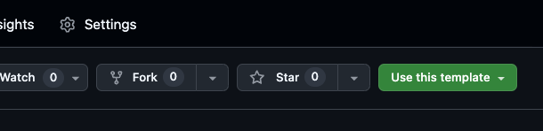
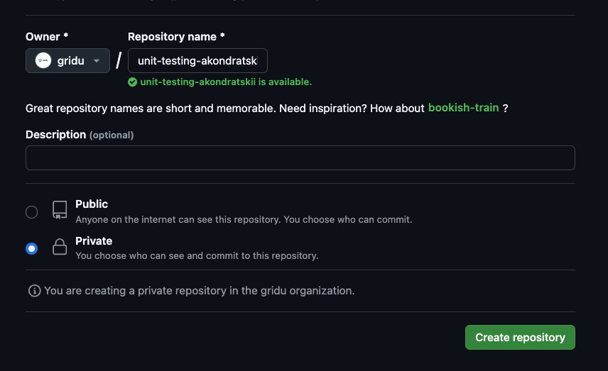

# Unit Testing: Practice Tasks

This repository contains practice tasks for the [Unit Testing](https://learning.griddynamics.com/#/online-courses/f70e294c-a3b0-4bab-a2ea-1a609ee347d8) course.

To finish the course, you will need to do at least 3 mandatory tasks. Follow the next steps:

## 1. Create repository

Create a new **private** repository in the **gridu** organization using this repository as a template by pressing the button "Use this template":





## 2. Install dependencies

Clone your new repository and install all the dependencies in it:

```sh
npm ci
```

## 3. Accomplish tasks

After you read tasks and wrote tests, push them into the `main` branch, and don't forget to notify course professors and share access to your repo with them.

Mandatory tasks:

- [Task 1: Quantity Validator](./task1/README.md)
- [Task 2: Validation method with external request](./task2/README.md)
- [Task 3: Mocking dates](./task3/README.md)

Advanced tasks (optional but still recommended):

- [Task 4: Parametrized tests](./task4/README.md)
- [Task 5: Testing stateful modules](./task5/README.md)
